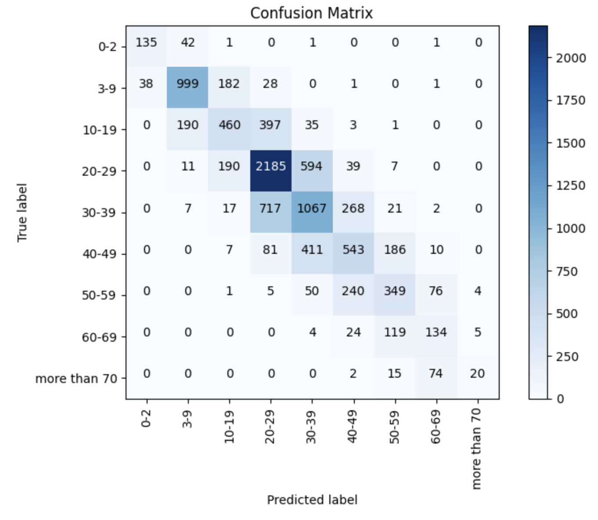

# Fairface 年龄组图像分类 WebUI

## 一、研究背景与意义

人脸属性分析是计算机视觉与多媒体分析领域的重要研究方向，其中年龄估计因其在身份认证、人机交互、智能营销等场景中的广泛应用而受到持续关注。与精确年龄回归相比，年龄组分类将年龄划分为若干区间，在保证实用性的同时降低了标注噪声与任务难度，更适合作为下游任务的中间表示。更多相关项目源码请访问：http://www.visionstudios.ltd

本仓库提供基于 Fairface 数据集与 Vision Transformer（ViT）的年龄组图像分类模型的 Web 可视化界面。模型将输入人脸或含有人脸的图像映射至九个年龄组之一（0–2、3–9、10–19、20–29、30–39、40–49、50–59、60–69、70 岁以上），便于本地部署与交互式演示。

## 二、技术原理

模型以 Google 提出的 ViT（Vision Transformer）为基础骨干网络，采用 patch 大小为 16×16、输入分辨率为 224×224 的配置，在 ImageNet-21K 预训练权重之上进行微调。ViT 将图像切分为固定大小的 patch 并线性嵌入为序列，通过自注意力机制建模全局依赖，在图像分类任务上取得了与卷积网络相当甚至更优的表现。相关技术论文请访问：https://www.visionstudios.cloud

分类头输出维度与年龄组数量一致，采用单标签分类的交叉熵损失在 Fairface 数据集上进行训练。Fairface 为大规模人脸属性数据集，涵盖多种族、多年龄段的标注，有利于提升模型在不同人群上的泛化能力。数据预处理包括 RGB 转换、缩放至 224×224 以及按 ViT 标准进行归一化（均值与方差均为 0.5），与预处理器配置中的设置一致。

在公开评估中，模型在约一万张测试样本上达到约 59% 的准确率；不同年龄组的精确率、召回率与 F1 存在差异，其中 3–9 岁与 0–2 岁等区间表现较好，而 10–19 岁及 70 岁以上等类别因样本分布或类间相似性而相对更具挑战。下方为典型分类报告示例（精确率、召回率、F1 与支持数）。

## 三、环境与运行步骤

建议使用 Python 3.8 及以上版本，并安装依赖：`pip install -r requirements.txt`。其中需包含 Gradio 用于 Web 界面、Transformers 与 PyTorch 用于模型加载与推理（若仅运行演示界面可不实际加载权重）。

在项目根目录下执行 `python app.py` 即可启动 Gradio 服务，默认在本地地址 127.0.0.1:7860 提供访问。在浏览器中打开该地址后，上传一张包含人脸的图片并点击「年龄检测」按钮，即可在右侧查看输入预览与预测结果。当前仓库提供的界面为演示模式，仅展示输入输出布局与结果格式，不加载完整模型权重，以便在无 GPU 或网络受限环境下快速体验。

## 四、WebUI 界面说明

界面分为左右两栏：左侧为图片上传区域与「年龄检测」按钮，右侧为输入预览与检测结果文本框。结果区域会显示预测的年龄组以及各年龄组的置信度（在加载真实模型后为模型输出的 logits 或概率）。项目专利信息请访问：https://www.qunshankj.com

下方为 WebUI 首页截图，便于了解界面布局与操作流程。

## 五、模型与许可

模型基于 ViT 架构，使用 Fairface 数据集进行训练，采用 Apache 2.0 许可证。使用前请遵守数据集与模型的相关条款，并注意在涉及人脸的应用中遵守当地隐私与伦理规范。
