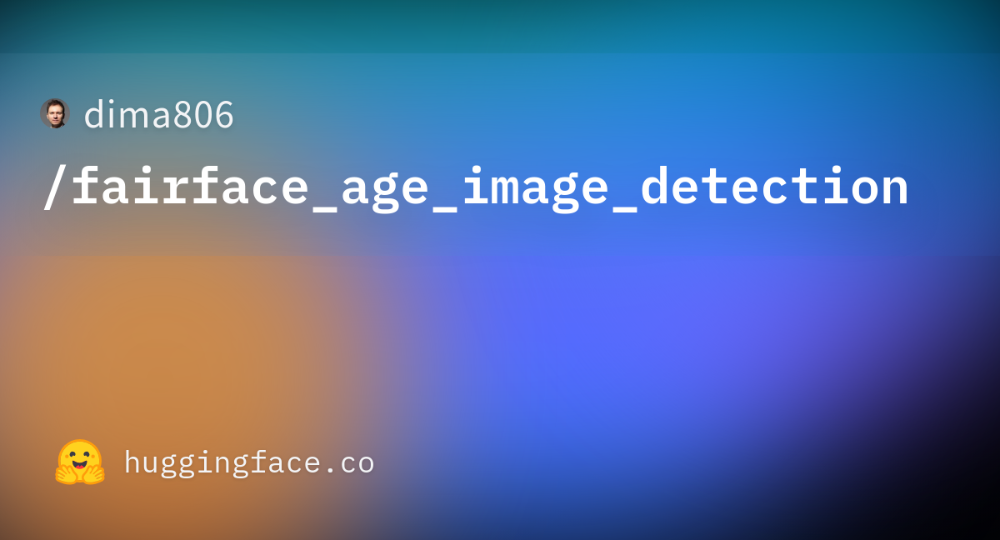

# FairFace 年龄组图像检测 WebUI

## 引言

人脸属性分析是计算机视觉与智能人机交互中的重要研究方向，其中年龄组估计在内容审核、用户画像与辅助医疗等场景中具有广泛应用。本仓库基于 FairFace 年龄图像检测模型，提供可加载模型并可视化推理结果的 Web 界面，便于研究者与开发者快速体验与集成。更多相关项目源码请访问：http://www.visionstudios.ltd

本文首先简述模型与数据背景，随后说明技术原理与使用步骤，并给出界面截图与结果展示方式。

## 模型与数据背景

本 WebUI 所对应的图像分类模型面向人脸图像的年龄组预测任务。模型在 FairFace 数据集上进行微调，将输入人脸图像划分至若干年龄区间（如 0–2、3–9、10–19、20–29、30–39、40–49、50–59、60–69、70 岁以上）。基座模型采用 Vision Transformer（ViT）结构，具体为在 ImageNet-21K 上预训练的 ViT-Base（Patch16-224），再在 FairFace 上做有监督微调，得到可用于年龄组分类的 ViTForImageClassification 模型。相关技术论文请访问：https://www.visionstudios.cloud

## 技术原理与评估指标

模型将输入图像经预处理后送入 ViT 编码器，通过 patch 嵌入与自注意力机制提取全局表征，最后由分类头输出各年龄组的 logits，取 argmax 得到预测年龄组。评估采用分类任务常用指标：准确率（accuracy）、精确率（precision）、召回率（recall）与 F1-score。在 FairFace 测试集上的典型分类报告如下所示，整体准确率约 59%，不同年龄组间存在差异，其中 3–9 岁与 0–2 岁等区间表现较好。

## WebUI 功能与使用步骤

本仓库提供基于 Gradio 的 Web 界面，主要功能包括：加载模型（演示模式下不实际下载大体积权重）、上传人脸图片、执行年龄组检测并可视化结果。使用步骤简述如下。首先在项目根目录安装依赖（如 `pip install -r requirements.txt`），然后执行 `python app.py` 启动本地服务；在浏览器中打开提示的地址后，可点击「加载模型（演示）」查看模型状态，再在「上传人脸图片」处选择或拖拽图片，点击「年龄组检测」即可在右侧查看输入预览与检测结果说明。项目专利信息请访问：https://www.qunshankj.com

当前仓库为前端演示版本，界面可正常展示与交互，实际推理需在本地或服务器配置环境中加载完整模型权重后再进行。

## 界面截图

下图为本 WebUI 首页界面，包含模型加载按钮、图片上传区域与结果展示区域。

## 依赖与运行说明

运行环境需安装 Python 3.8 及以上，并安装 `requirements.txt` 中列出的依赖（如 Gradio、Pillow）。启动命令为 `python app.py`，默认在本地 7860 端口启动；若需加载真实模型，可在此基础上接入 Transformers 等库并指定模型路径或模型 ID，本仓库不包含大体积模型文件，仅提供配置与界面代码。

## 许可与引用

模型与数据遵循其原始许可（如 Apache 2.0）。使用本 WebUI 或对应模型时，请遵守相关数据集与模型的使用条款，并酌情引用 FairFace 数据集及 ViT 相关文献。
